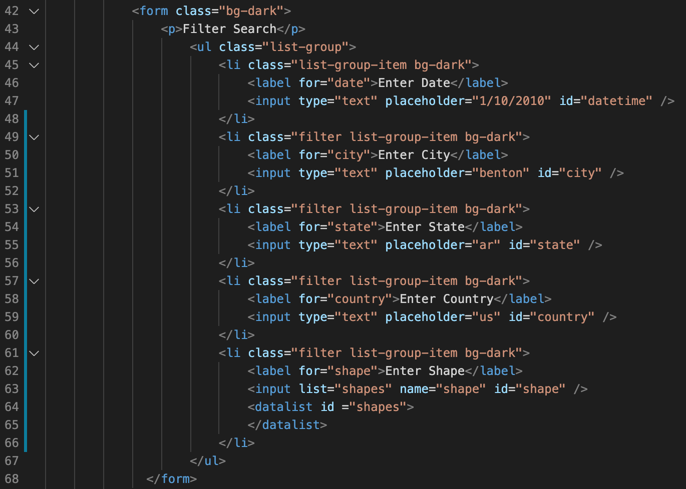
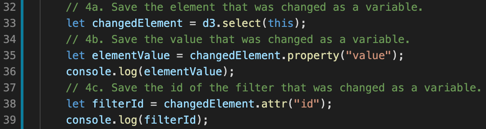
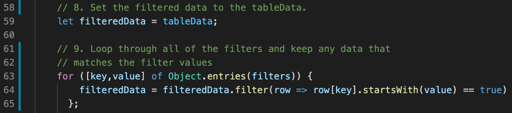
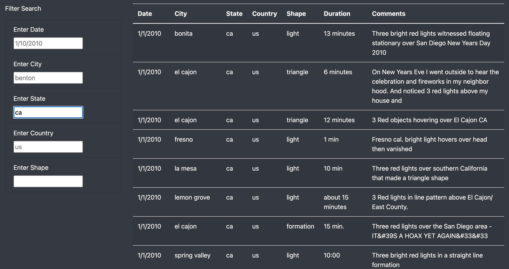
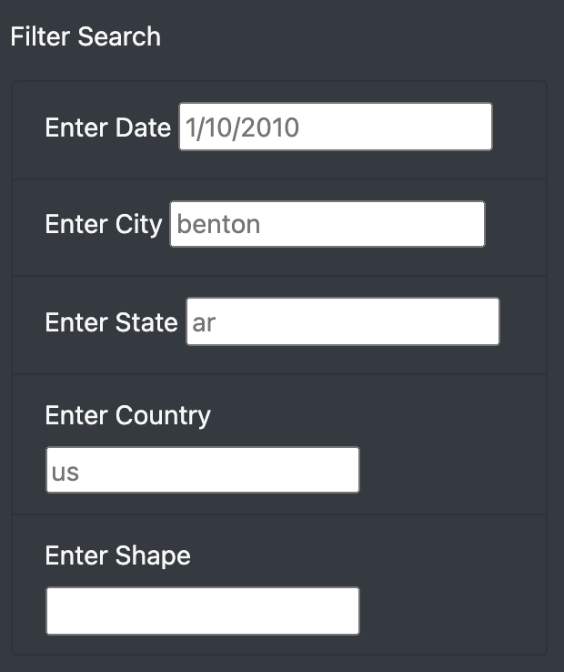
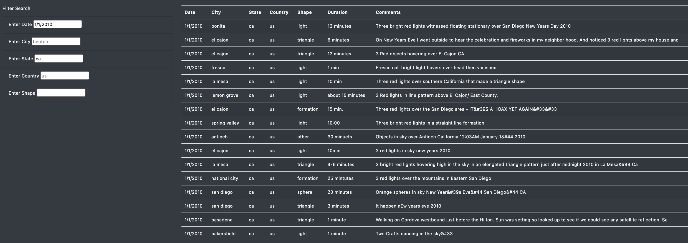

# UFOs
Help a data journalist, Dana, to develop an HTML page that holds her UFO articles and the table of data to support her findings. However, because there is so much data, an easy to use filters will be add on by using Javascript to fine tune the results. 

## Project Overview
- Build a table using data stored in a JavaScript array
- Equip table with several fully functional filters that will allow users to interact 
- Place the table into an HTML file for easy viewing
- Customize your webpage using Bootstrap

### Deliverable 1: Filter UFO sightings on multiple criteria 
- The list element that creates the button is removed, and there are five list elements for filtering in the <a href = "https://github.com/angelnga/UFOs/blob/main/index.html"> index.html </a> file.
   

- The event listener is modified to detect changes to each filter in the <a href = "https://github.com/angelnga/UFOs/blob/main/static/js/app.js"> app.js </a> file.
   

- The updateFilters() function saves the element, value, and the id of the filter that was changed.
   

- The filterTable() function loops through all of the filters and keeps any data that matches the filter values. 
   

- The webpage filters the table correctly based on user input
   

## Results
Guideline for table filters:
1. All Data is shown on the right as default
2. Filter data by date, city, country and shape with the seach field
 
3. Input one or muiltiple search fields to narrow down the result
 
4. Reset filter by clicking "UFO Sightings" at the begining of the page, refreshing pages or empty search field.
 

## Summary
Describe one drawback of this new design and two recommendations for further development.
- Drawback: All search field is open answer, user has to input the exact value for the result
- Recommendations: 
  1. Add dropdown menu with options for "City", "State" and Shape" search
  2. Add drop down calender with date range select options
  3. Add "No Result Found" when search input does not match any data 
